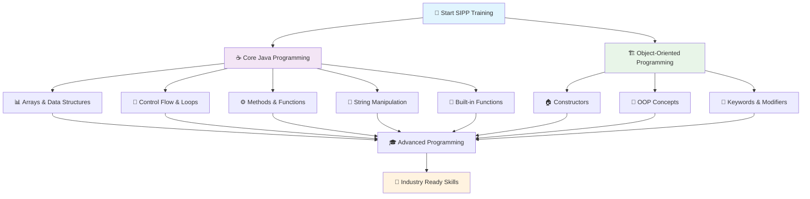
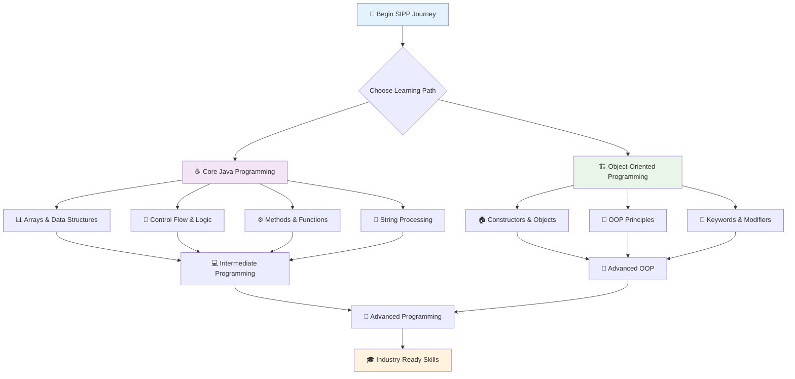

# 🎓 Bridgelabz SIPP Training

<div align="center">


**A comprehensive Java programming training repository from Bridgelabz SIPP Program**

[](https://github.com/Sahilgupta2175/Bridgelabz-SIPP-training)
[](https://github.com/Sahilgupta2175/Bridgelabz-SIPP-training/forks)

</div>

## 📚 Training Overview

This repository documents my comprehensive journey through the **Bridgelabz Summer Placement Programming Practice (SIPP)** training program, showcasing progressive Java programming skills organized into two comprehensive learning paths.

### 🔗 Quick Navigation

- ☕ [Core Java Programming](#-core-java-programming) | [🌐 Browse Core Java Branch](https://github.com/Sahilgupta2175/Bridgelabz-SIPP-training/tree/core-java-programming)
- 🏗️ [Object-Oriented Programming](#%EF%B8%8F-object-oriented-programming-oop) | [🌐 Browse OOP Branch](https://github.com/Sahilgupta2175/Bridgelabz-SIPP-training/tree/oops)
- 🛠️ [Getting Started Guide](#%EF%B8%8F-getting-started)
- 📈 [Learning Path](#-learning-roadmap)
- 🎯 [Training Objectives](#-training-objectives)
- 🤝 [How to Contribute](#-contributing)

---

## �📋 Training Flow Chart



## 🚀 How to Use This Repository

### 🔍 **For Learning**
1. **📚 Browse by Topic**: Use the expandable sections below to explore specific programming concepts
2. **🔗 Follow Links**: Click on GitHub links to view actual code implementations
3. **📈 Progressive Learning**: Start with Core Java, then advance to OOP concepts
4. **💻 Hands-on Practice**: Clone the repository to run and experiment with code locally

### 🛠️ **For Development**
1. **🔄 Clone Repository**: Get a local copy for experimentation
2. **🌿 Switch Branches**: Navigate between `core-java-programming` and `oops` branches
3. **📝 Study Code**: Review implementations and coding patterns
4. **🚀 Build Projects**: Use the exercises as building blocks for larger projects

---

## 📚 Training Contents
- [Bridgelabz SIPP Training](#bridgelabz-sipp-training)
  - [📋 Flow Chart](#-flow-chart)
  - [🚀 How to Use This Repository](#-how-to-use-this-repository)
  - [📚 Contents](#-contents)
  - [Core Java Programming](#core-java-programming)
  - [Object-Oriented Programming (OOP)](#object-oriented-programming-oop)

## ☕ Core Java Programming

> 🎯 **Focus**: Building strong foundations in Java programming fundamentals  
> 📊 **Difficulty**: Beginner to Intermediate  
> ⏱️ **Estimated Duration**: 6-8 weeks  
> 🔗 **Branch**: [📁 core-java-programming](https://github.com/Sahilgupta2175/Bridgelabz-SIPP-training/tree/core-java-programming)

<details>
<summary><b>🔄 Array Operations & Data Structures</b></summary>

### 📊 Array Fundamentals
| 🎯 Topic | 📝 Description | 🔗 Source Code |
|----------|----------------|----------------|
| **Basic Arrays** | Fundamental array operations and manipulations | [📁 Array Exercises](https://github.com/Sahilgupta2175/Bridgelabz-SIPP-training/tree/core-java-programming/Array) |
| **Java Arrays Level 1** | Beginner-friendly array problems | [📁 Level 1](https://github.com/Sahilgupta2175/Bridgelabz-SIPP-training/tree/core-java-programming/Java-Arrays/Level-1) |
| **Java Arrays Level 2** | Advanced array manipulations and algorithms | [📁 Level 2](https://github.com/Sahilgupta2175/Bridgelabz-SIPP-training/tree/core-java-programming/Java-Arrays/Level-2) |

**🎓 Learning Outcomes**: Master array fundamentals, understand memory management, implement efficient algorithms

</details>

<details>
<summary><b>🔧 Built-in Functions & Core Libraries</b></summary>

### 🛠️ Java Built-in Functions
| 🎯 Level | 📝 Description | 🔗 Source Code |
|----------|----------------|----------------|
| **Level 1** | Basic built-in function exercises | [📁 Level 1](https://github.com/Sahilgupta2175/Bridgelabz-SIPP-training/tree/core-java-programming/Built-in-Function-practice/level-1) |
| **Level 2** | Advanced built-in function challenges | [📁 Level 2](https://github.com/Sahilgupta2175/Bridgelabz-SIPP-training/tree/core-java-programming/Built-in-Function-practice/level-2) |

**🎓 Learning Outcomes**: Leverage Java's extensive library, understand API documentation, efficient coding practices

</details>

<details>
<summary><b>🔀 Control Flow & Decision Making</b></summary>

### 🌊 Flow Control Mastery
| 🎯 Level | 📝 Description | 🔗 Source Code |
|----------|----------------|----------------|
| **Level 1** | Basic control flow exercises | [📁 Level 1](https://github.com/Sahilgupta2175/Bridgelabz-SIPP-training/tree/core-java-programming/Java-Control-Flows/Level-1) |
| **Level 2** | Intermediate control flow problems | [📁 Level 2](https://github.com/Sahilgupta2175/Bridgelabz-SIPP-training/tree/core-java-programming/Java-Control-Flows/Level-2) |
| **Level 3** | Advanced control flow challenges | [📁 Level 3](https://github.com/Sahilgupta2175/Bridgelabz-SIPP-training/tree/core-java-programming/Java-Control-Flows/Level-3) |
| **Extra Practice** | Additional control flow exercises | [📁 Additional](https://github.com/Sahilgupta2175/Bridgelabz-SIPP-training/tree/core-java-programming/control-flows) |

**🎓 Learning Outcomes**: Master program flow control, implement complex logic, optimize algorithm efficiency

</details>

<details>
<summary><b>⚙️ Methods & Function Design</b></summary>

### 🔧 Method Engineering
| 🎯 Level | 📝 Description | 🔗 Source Code |
|----------|----------------|----------------|
| **Level 1** | Basic method exercises | [📁 Level 1](https://github.com/Sahilgupta2175/Bridgelabz-SIPP-training/tree/core-java-programming/Java-Methods/Level-1) |
| **Level 2** | Intermediate method problems | [📁 Level 2](https://github.com/Sahilgupta2175/Bridgelabz-SIPP-training/tree/core-java-programming/Java-Methods/Level-2) |
| **Level 3** | Advanced method concepts | [📁 Level 3](https://github.com/Sahilgupta2175/Bridgelabz-SIPP-training/tree/core-java-programming/Java-Methods/Level-3) |
| **Additional Methods** | Extended method practice | [📁 More Methods](https://github.com/Sahilgupta2175/Bridgelabz-SIPP-training/tree/core-java-programming/Methods) |

**🎓 Learning Outcomes**: Write modular code, understand method design principles, implement recursive solutions

</details>

<details>
<summary><b>📝 String Manipulation & Text Processing</b></summary>

### 🔤 String Mastery
| 🎯 Level | 📝 Description | 🔗 Source Code |
|----------|----------------|----------------|
| **Level 1** | Basic string operations | [📁 Level 1](https://github.com/Sahilgupta2175/Bridgelabz-SIPP-training/tree/core-java-programming/Java-Strings/Level-1) |
| **Level 2** | Intermediate string manipulations | [📁 Level 2](https://github.com/Sahilgupta2175/Bridgelabz-SIPP-training/tree/core-java-programming/Java-Strings/Level-2) |
| **Level 3** | Advanced string processing | [📁 Level 3](https://github.com/Sahilgupta2175/Bridgelabz-SIPP-training/tree/core-java-programming/Java-Strings/Level-3) |
| **Extra Challenges** | Complex string problems | [📁 Extra Questions](https://github.com/Sahilgupta2175/Bridgelabz-SIPP-training/tree/core-java-programming/Java-Strings/Extra-Questions) |
| **Additional Practice** | More string exercises | [📁 String Extras](https://github.com/Sahilgupta2175/Bridgelabz-SIPP-training/tree/core-java-programming/Strings) |

**🎓 Learning Outcomes**: Master text processing, understand string immutability, implement efficient string algorithms

</details>

<details>
<summary><b>🌱 Programming Fundamentals & Core Concepts</b></summary>

### 💻 Foundation Building
| 🎯 Category | 📝 Description | 🔗 Source Code |
|-------------|----------------|----------------|
| **Programming Elements** | Core Java programming concepts | [📁 Java Fundamentals](https://github.com/Sahilgupta2175/Bridgelabz-SIPP-training/tree/core-java-programming/Java-Programming-Elements) |
| **Level 1 Practice** | Basic programming exercises | [📁 Level 1](https://github.com/Sahilgupta2175/Bridgelabz-SIPP-training/tree/core-java-programming/level-1) |
| **Level 2 Practice** | Intermediate programming challenges | [📁 Level 2](https://github.com/Sahilgupta2175/Bridgelabz-SIPP-training/tree/core-java-programming/level-2) |

**🎓 Learning Outcomes**: Build strong programming foundation, develop problem-solving mindset, understand Java syntax thoroughly

</details>

## 🏗️ Object-Oriented Programming (OOP)

> 🎯 **Focus**: Mastering OOP principles and advanced Java concepts  
> 📊 **Difficulty**: Intermediate to Advanced  
> ⏱️ **Estimated Duration**: 4-6 weeks  
> 🔗 **Branch**: [📁 oops](https://github.com/Sahilgupta2175/Bridgelabz-SIPP-training/tree/oops)

<details>
<summary><b>� Constructors & Object Creation</b></summary>

### 🏗️ Constructor Mastery
| 🎯 Level | 📝 Description | 🔗 Source Code |
|----------|----------------|----------------|
| **Level 1** | Java constructors, instance vs. class variables | [📁 Constructors L1](https://github.com/Sahilgupta2175/Bridgelabz-SIPP-training/tree/oops/Constructors/Level-1) |

**🎓 Learning Outcomes**: 
- ✅ Understand object initialization
- ✅ Master constructor overloading
- ✅ Learn access modifiers in constructors
- ✅ Implement proper object creation patterns

</details>

<details>
<summary><b>🧩 Core OOP Concepts</b></summary>

### 🎯 OOP Fundamentals
| 🎯 Level | 📝 Description | 🔗 Source Code |
|----------|----------------|----------------|
| **Level 1** | Fundamental OOP concepts (classes, objects) | [📁 OOP Level 1](https://github.com/Sahilgupta2175/Bridgelabz-SIPP-training/tree/oops/OOPS/Level-1) |
| **Level 2** | Advanced OOP concepts | [📁 OOP Level 2](https://github.com/Sahilgupta2175/Bridgelabz-SIPP-training/tree/oops/OOPS/Level-2) |

**🎓 Learning Outcomes**: 
- ✅ Master the four pillars of OOP
- ✅ Design scalable class hierarchies
- ✅ Implement inheritance and polymorphism
- ✅ Apply abstraction principles

</details>

<details>
<summary><b>🔑 Keywords and Modifiers</b></summary>

### 🔧 Java Keywords Mastery
| 🎯 Topic | 📝 Description | 🔗 Source Code |
|----------|----------------|----------------|
| **Static, this, final** | Essential Java keywords and scope management | [📁 Keywords](https://github.com/Sahilgupta2175/Bridgelabz-SIPP-training/tree/oops/Static-find-this) |

**🎓 Learning Outcomes**: 
- ✅ Understand static vs instance members
- ✅ Master this keyword usage
- ✅ Implement final classes and methods
- ✅ Manage scope and visibility effectively

</details>

---

## 🛠️ Getting Started

### 📋 Prerequisites
- ☕ **Java Development Kit (JDK) 8 or higher** - [📥 Download JDK](https://www.oracle.com/java/technologies/downloads/)
- 💻 **Integrated Development Environment** (Choose one):
  - [🌙 Eclipse IDE](https://www.eclipse.org/downloads/) - Free, comprehensive Java IDE
  - [🧠 IntelliJ IDEA](https://www.jetbrains.com/idea/) - Professional Java development
  - [⚡ VS Code](https://code.visualstudio.com/) with [Java Extension Pack](https://marketplace.visualstudio.com/items?itemName=vscjava.vscode-java-pack)
  - [☀️ NetBeans](https://netbeans.apache.org/) - Apache NetBeans IDE
- 📚 **Basic Programming Knowledge** - Understanding of programming fundamentals

### 🚀 Quick Setup Guide

#### 1️⃣ Clone the Repository
```bash
# Using HTTPS
git clone https://github.com/Sahilgupta2175/Bridgelabz-SIPP-training.git

# Using SSH (if you have SSH keys configured)
git clone git@github.com:Sahilgupta2175/Bridgelabz-SIPP-training.git

# Using GitHub CLI
gh repo clone Sahilgupta2175/Bridgelabz-SIPP-training
```

#### 2️⃣ Navigate to Project Directory
```bash
cd Bridgelabz-SIPP-training

# Explore the structure
ls -la
# or on Windows Command Prompt
dir
```

#### 3️⃣ Choose Your Learning Branch
```bash
# For Core Java Programming
git checkout core-java-programming

# For Object-Oriented Programming
git checkout oops

# Return to main branch
git checkout main
```

#### 4️⃣ Compile and Execute Java Programs
```bash
# Compile Java files
javac ClassName.java

# Run the compiled program
java ClassName

# Example workflow
javac Calculator.java
java Calculator

# Compile multiple files at once
javac *.java
```

### 🔧 IDE-Specific Setup

#### 🌙 **Eclipse IDE Setup**
1. **Import Project**: File → Import → Existing Projects into Workspace
2. **Select Directory**: Choose the cloned repository folder
3. **Run Programs**: Right-click Java file → Run As → Java Application

#### 🧠 **IntelliJ IDEA Setup**
1. **Open Project**: File → Open → Select repository folder
2. **Auto-Configuration**: IntelliJ automatically detects Java files
3. **Execute**: Use `Shift+F10` or click the green arrow to run

#### ⚡ **VS Code Setup**
1. **Install Extension**: Java Extension Pack by Microsoft
2. **Open Folder**: File → Open Folder → Select repository
3. **Run Code**: Press `F5` or use Run button in editor

### 📖 Essential Resources
- 📘 [Official Java Documentation](https://docs.oracle.com/en/java/)
- 🎓 [Oracle Java Tutorials](https://docs.oracle.com/javase/tutorial/)
- 💡 [Java Best Practices](https://www.oracle.com/java/technologies/javase/codeconventions-introduction.html)
- 🤝 [Stack Overflow Java](https://stackoverflow.com/questions/tagged/java) - Community help
- 🏢 [Bridgelabz Official](https://bridgelabz.com/) - Training provider

---

## 📈 Learning Roadmap



### 🎯 Skill Progression Timeline

| 📅 Phase | ⏱️ Duration | 🎯 Focus | 📊 Difficulty | 🏆 Outcome |
|----------|-------------|---------|---------------|------------|
| **Phase 1** | Week 1-2 | Java Fundamentals | 🟢 Beginner | Basic syntax mastery |
| **Phase 2** | Week 3-5 | Control Structures | 🟡 Intermediate | Logic & flow control |
| **Phase 3** | Week 6-8 | Methods & Arrays | 🟡 Intermediate | Modular programming |
| **Phase 4** | Week 9-11 | OOP Concepts | 🟠 Advanced | Object-oriented design |
| **Phase 5** | Week 12-14 | Advanced Topics | 🔴 Expert | Professional development |

---

## 🎯 Training Objectives

### 🎓 **Core Java Mastery**
- ✅ **Syntax Proficiency**: Write clean, efficient Java code
- ✅ **Problem Solving**: Develop algorithmic thinking
- ✅ **Data Handling**: Master arrays, strings, and basic data structures
- ✅ **Flow Control**: Implement complex decision-making logic
- ✅ **Method Design**: Create reusable, modular functions

### 🏗️ **Object-Oriented Excellence**
- ✅ **OOP Principles**: Apply encapsulation, inheritance, polymorphism, and abstraction
- ✅ **Class Design**: Architect scalable and maintainable class hierarchies
- ✅ **Constructor Mastery**: Implement proper object initialization patterns
- ✅ **Keyword Usage**: Leverage static, final, and this keywords effectively
- ✅ **Code Organization**: Structure programs using OOP best practices

### 💼 **Professional Development**
- ✅ **Industry Standards**: Follow Java coding conventions and best practices
- ✅ **Documentation**: Write clear, maintainable code with proper comments
- ✅ **Version Control**: Understand Git workflow and branch management
- ✅ **Problem Analysis**: Break down complex problems into manageable solutions
---

## 🤝 Contributing

We welcome contributions from fellow developers and learners! Whether you're fixing bugs, adding new exercises, or improving documentation, your input is valuable.

### 🌟 Ways to Contribute

#### 📝 **Code Contributions**
- Add new Java programming exercises
- Improve existing solutions with better algorithms
- Add comprehensive code comments and documentation
- Create unit tests for exercises

#### 📚 **Documentation & Learning Materials**
- Enhance README documentation
- Add step-by-step tutorials for complex topics
- Create learning guides for specific concepts
- Improve code explanations

#### 🐛 **Bug Reports & Feature Requests**
- [🐞 Report Issues](https://github.com/Sahilgupta2175/Bridgelabz-SIPP-training/issues/new) - Found a bug? Let us know!
- [💡 Suggest Features](https://github.com/Sahilgupta2175/Bridgelabz-SIPP-training/issues/new) - Have ideas for improvement?
- [❓ Ask Questions](https://github.com/Sahilgupta2175/Bridgelabz-SIPP-training/discussions) - Need help or clarification?

### 🚀 How to Contribute

#### 1️⃣ **Fork & Clone**
```bash
# Fork the repository on GitHub, then clone your fork
git clone https://github.com/YOUR_USERNAME/Bridgelabz-SIPP-training.git
cd Bridgelabz-SIPP-training
```

#### 2️⃣ **Create Feature Branch**
```bash
git checkout -b feature/your-improvement
# Examples:
# git checkout -b feature/add-sorting-exercises
# git checkout -b docs/improve-setup-guide
```

#### 3️⃣ **Make Your Changes**
- Follow Java coding conventions
- Add meaningful comments
- Test your code thoroughly
- Ensure proper documentation

#### 4️⃣ **Commit & Push**
```bash
git add .
git commit -m "Add: Description of your changes"
git push origin feature/your-improvement
```

#### 5️⃣ **Create Pull Request**
- Go to your fork on GitHub
- Click "Create Pull Request"
- Provide detailed description of changes
- Reference any related issues

### 📋 **Contribution Guidelines**
- ✅ Follow Java naming conventions and best practices
- ✅ Write clear, self-documenting code
- ✅ Include comments for complex algorithms
- ✅ Test all new code before submitting
- ✅ Update documentation as needed

---

## 📞 Contact & Support

### 🔗 **Repository Information**
- 🏠 **Main Repository**: [Bridgelabz-SIPP-training](https://github.com/Sahilgupta2175/Bridgelabz-SIPP-training)
- 📊 **Repository Stats**: [Insights & Analytics](https://github.com/Sahilgupta2175/Bridgelabz-SIPP-training/pulse)
- 🌐 **Network**: [Forks & Contributors](https://github.com/Sahilgupta2175/Bridgelabz-SIPP-training/network)
- 📈 **Activity**: [Commit History](https://github.com/Sahilgupta2175/Bridgelabz-SIPP-training/commits)

### 🆘 **Get Help**
- 🐛 **Issues**: [Browse & Report Issues](https://github.com/Sahilgupta2175/Bridgelabz-SIPP-training/issues)
- 💬 **Discussions**: [Community Forum](https://github.com/Sahilgupta2175/Bridgelabz-SIPP-training/discussions)
- 📖 **Documentation**: [Wiki Pages](https://github.com/Sahilgupta2175/Bridgelabz-SIPP-training/wiki)
- 🔍 **Search**: [Find Solutions](https://github.com/Sahilgupta2175/Bridgelabz-SIPP-training/search)

### 👤 **Connect**
- **Repository Owner**: [@Sahilgupta2175](https://github.com/Sahilgupta2175)
- **Training Provider**: [🏢 Bridgelabz](https://bridgelabz.com/)
- **Professional Network**: [LinkedIn](https://www.linkedin.com/company/bridgelabz/)

### 📚 **Additional Resources**
- 🎓 [Bridgelabz Courses](https://bridgelabz.com/courses)
- 📺 [Bridgelabz YouTube](https://www.youtube.com/c/BridgeLabz)
- 🐦 [Follow on Twitter](https://twitter.com/bridgelabz)
- 📧 [Contact Bridgelabz](https://bridgelabz.com/contact)

---

<div align="center">

**🌟 Happy Learning & Coding! 🌟**

*Crafted with ❤️ for Bridgelabz SIPP Training Program*

### 📊 **Repository Statistics**
[](https://github.com/Sahilgupta2175/Bridgelabz-SIPP-training)
[](https://github.com/Sahilgupta2175/Bridgelabz-SIPP-training/forks)
[](https://github.com/Sahilgupta2175/Bridgelabz-SIPP-training/watchers)

[](https://github.com/Sahilgupta2175/Bridgelabz-SIPP-training/issues)
[](https://github.com/Sahilgupta2175/Bridgelabz-SIPP-training/pulls)
[](https://github.com/Sahilgupta2175/Bridgelabz-SIPP-training/commits)

### 🔗 **Quick Navigation**
[🏠 Home](https://github.com/Sahilgupta2175/Bridgelabz-SIPP-training) • 
[☕ Core Java](https://github.com/Sahilgupta2175/Bridgelabz-SIPP-training/tree/core-java-programming) • 
[🏗️ OOP](https://github.com/Sahilgupta2175/Bridgelabz-SIPP-training/tree/oops) • 
[🐛 Issues](https://github.com/Sahilgupta2175/Bridgelabz-SIPP-training/issues) • 
[💬 Discussions](https://github.com/Sahilgupta2175/Bridgelabz-SIPP-training/discussions)

### 🎓 **Bridgelabz Resources**
[🌐 Official Website](https://bridgelabz.com/) • 
[📚 Training Programs](https://bridgelabz.com/courses) • 
[💼 Career Opportunities](https://bridgelabz.com/careers) • 
[📧 Get in Touch](https://bridgelabz.com/contact)

---

**⭐ If this repository helped you in your Java learning journey, please consider giving it a star!**

**🔄 Found this useful? Share it with your coding community!**

**🎯 Ready to start your SIPP journey? [Clone the repository](https://github.com/Sahilgupta2175/Bridgelabz-SIPP-training.git) and begin coding!**

</div>
